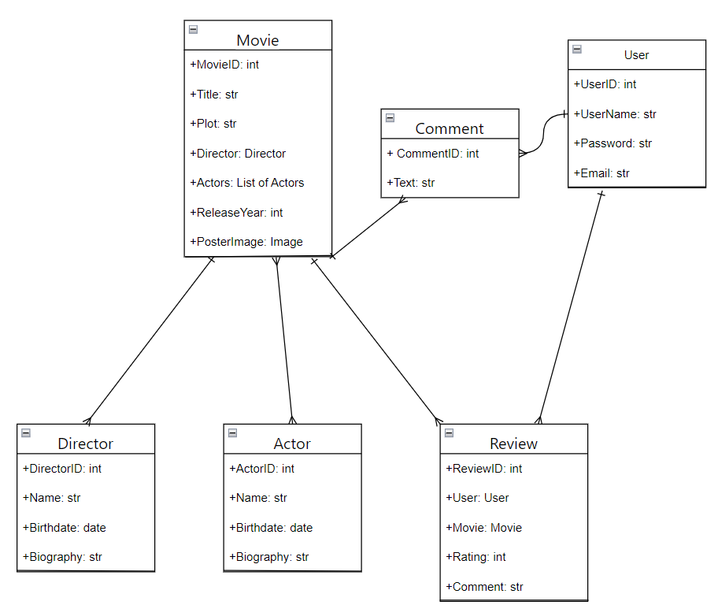
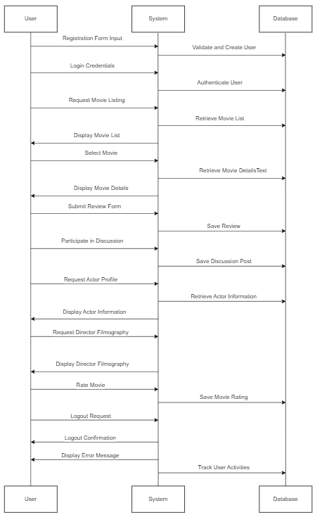

# Django IMDb Clone

Django IMDb Clone is a project that provides functionality for searching and viewing movies, user registration, and the ability to leave comments and reviews for movies. The project supports movie search by rating, actor, and director.




## Running the Project using Docker Compose

The project is deployed using Docker Compose. To run it, follow these steps:

1. Make sure you have Docker and Docker Compose installed.

2. Create a `.env` file in the project root and specify the required environment variables:

   ```dotenv
   DOCKER_DATABASE_URL=postgres://user:password@db:5432/dbname
   DOCKER_POSTGRES_DB=dbname
   DOCKER_POSTGRES_USER=user
   DOCKER_POSTGRES_PASSWORD=password
   AWS_ACCESS_KEY_ID=your_aws_key_id
   AWS_SECRET_ACCESS_KEY=your_aws_access_key
   AWS_STORAGE_BUCKET_NAME=your_aws_storage_bucket_name
   AWS_S3_REGION_NAME=your_s3_region_name
## Start the project with the following command:

   ```bash
   docker-compose up --build
   ```

### After a successful launch, your application will be available at http://localhost:8080.

## Importing Movies from IMDb

The project includes a Django command for importing movies from IMDb. To perform the import, use the following command:

```bash
docker-compose exec app python manage.py import_movies
```
The command will fetch movies from IMDb, save them to the database, and display a success message.

## Creating a Superuser

To create a Django superuser, use the following command:

```bash
docker-compose exec app python manage.py createsuperuser
```
Follow the instructions to enter the username, email, and password.

# Additional Information

## To update Python dependencies, run:
```bash
docker-compose exec app pip install -r requirements.txt
```

## To migrate the database, run:

```bash
docker-compose exec app python manage.py migrate
```
Adjust Nginx configuration in the nginx folder according to your needs.

If you make changes to movie models, don't forget to create and apply migrations:

```bash
docker-compose exec app python manage.py makemigrations
docker-compose exec app python manage.py migrate
```

This serves as a basic guide for deploying and using your Django IMDb Clone project. 
# We hope you find it helpful!